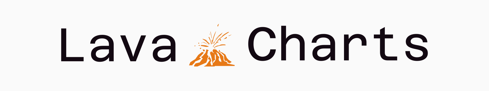

<h1 align="center">
  <br>
   
  <br>
</h1>

[](https://artifacthub.io/packages/search?repo=lava)   

## Overview

Welcome to the official Helm Charts repository for Lava Network! This repository contains Helm charts for deploying and managing various components of the Lava Network ecosystem on Kubernetes clusters.
Our charts are designed to simplify the deployment process, ensuring scalability, reliability, and ease of management for your Lava Network infrastructure.

## Available Charts

| Name | Description |
| --- | --- |
| [cache](./charts/cache/) | A high-performance, in-memory caching system |
| [provider](./charts/provider/) | Service provider component for the Lava Network |
| [consumer](./charts/consumer/) | Client component for consuming services on the Lava Network |

## Quick Start

To get started with our Helm charts, follow these steps:

1. Add the Lava Network Helm repository:

   ```shell
   helm repo add lavanet https://lavanet.github.io/helm-charts
   helm repo update
   ```

2. Install a chart (e.g., lava-cache):

   ```shell
   helm install my-lava-cache lavanet/cache
   ```

⭐️ If you find our Helm charts useful, please consider giving this repository a star! ⭐️

## Contributing

We welcome contributions from the community! If you'd like to contribute:

1. Fork the repository
2. Create your feature branch (`git checkout -b feature/AmazingFeature`)
3. Commit your changes (`git commit -m 'Add some AmazingFeature'`)
4. Push to the branch (`git push origin feature/AmazingFeature`)
5. Open a Pull Request

## Support and Community

* Join our [Discord](https://discord.gg/lavanetxyz) community for real-time support and discussions
* Follow us on [X](https://x.com/lavanetxyz) for the latest updates

## License

This project is licensed under the Apache License 2.0 - see the LICENSE file for details.
